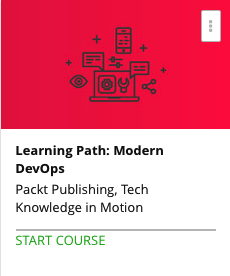

```
Roberto Nogueira  
BSd EE, MSd CE
Solution Integrator Experienced - Certified by Ericsson
```
# Udemy Modern DevOps



**About **

Learn everything you need to about the subject of this `Udemy` project.

[Homepage](https://udemy.com)

## Topics
```
0 / 25
Mastering Docker
[x] 53. The Course Overview 4:00
[x] 54. Recollecting Docker Concepts 7:33
[~] 55. Docker CLI Commands 10:48
[ ] 56. Scripting Primer 10:42
[ ] 57. Composing Primer 10:08
[ ] 58. Deploying Composed Services 14:12
[ ] 59. Single Host Scaling 3:58
[ ] 60. Bridge Networks 11:25
[ ] 61. Multi-host Networks 3:09
[ ] 62. Service Discovery 8:26
[ ] 63. Designing Infrastructure of the Social Network 8:04
[ ] 64. Swarm Basics 14:53
[ ] 65. Swarm on AWS 7:10
[ ] 66. Introduction to Managed Cluster 6:13
[ ] 67. Kubernetes 8:54
[ ] 68. Marathon / Mesos 11:41
[ ] 69. Attack Vectors 7:30
[ ] 70. Docker Bench for Security 5:48
[ ] 71. Notary and Content Security 5:03
[ ] 72. Logging Drivers 5:05
[ ] 73. Volume Plugins 4:41
[ ] 74. Network Plugins 4:44
[ ] 75. Keeping the Garden Pruned 9:38
[ ] 76. Ecosystem Tools 4:25
[ ] 77. Dockercraft 3:36

0 / 32
Mastering Puppet for Large Infrastructures
[ ] 78. The Course Overview 2:36
[ ] 79. Introducing Puppet and Terms Associated with Puppet 17:53
[ ] 80. Puppet Code, Puppet Servers, and Environments 6:50
[ ] 81. More about Puppet Servers and Environments 7:15
[ ] 82. Git Control Repositories and r10K 19:00
[ ] 83. Creating a Puppet Server Machine from Scratch 10:15
[ ] 84. Expanding on Our Standalone Puppet CA Machine 9:28
[ ] 85. Enterprise Configuration - Master of Master(MOM) 7:32
[ ] 86. Performance Tuning with Puppet Server 5:47
[ ] 87. Understanding Storeconfigs and PuppetDB 16:19
[ ] 88. Exported Resources 4:35
[ ] 89. PuppetDB's GUI 4:42
[ ] 90. PuppetDB's API 5:57
[ ] 91. Public Modules 19:52
[ ] 92. Creating Our Own Custom Facts 8:27
[ ] 93. Running Our Own Custom Types 9:21
[ ] 94. Using Heira 12:28
[ ] 95. Using the 'ensure => absent' 1:26
[ ] 96. Setting Up Puppet for Reporting 5:42
[ ] 97. Foreman Reporter with Our Puppet Installation 7:06
[ ] 98. PuppetDB to Store Reports 3:30
[ ] 99. Using Report Processors to Monitor Systems 4:13
[ ] 100. How to Check the Syntax of Our Code? 8:19
[ ] 101. Using rspec-puppet to Create Tests for Our Code 10:46
[ ] 102. Beaker 7:12
[ ] 103. Test Kitchen 13:59
[ ] 104. Jenkins 12:02
[ ] 105. APIs 8:24
[ ] 106. SSL Certificates 10:15
[ ] 107. Metaparameters and Ordering 9:35
[ ] 108. Using PRY to Inspect the Puppet Server 5:58
[ ] 109. Puppet Best Practices 10:00
```
